# REM RAG - Random Emergent Memory RAG

A novel AI system that learns like humans by reading Foreign Affairs articles chronologically and "dreaming" to discover hidden patterns across time.

## Quick Start

```bash
# Clone the repository
git clone [repository-url]
cd rem_rag_v2

# Create virtual environment
python -m venv venv
source venv/bin/activate  # On Windows: venv\Scripts\activate

# Install dependencies
pip install -r requirements.txt

# Set up environment
export OPENAI_API_KEY=your-key-here  # Or add to .env file

# Run 1922 experiment (proven working!)
python scripts/run_1922_fixed.py

# Run with REM cycles
python scripts/run_1922_with_rem.py

# Visualize a single REM step
python scripts/test_rem_step.py
```

## What is REM RAG?


The main philosophy is inspired by Raptor RAG, which does heirarchical clustering and summarization on nodes. Synthesized nodes contribute more to good answers than raw text nodes. Main take away? The more the merrier! Preprocess cognition. With this project i intend to make as many connections as possible to not only know everything from an expert dataset, but to synthesize and unify knowledge and lessons to be learned from all this information. A human consolidates their knowledge into a coherant whole (ideally). We add nodes to make nodes among similar nodes coherant (if needed), and we add nodes to make disparate nodes completely unrelated to each other coherant. Each RAG  node is implanted in a process which first does an N nearest neighbor comparison, and asks how does what we're learning correspond with what we already know. We process node chunks from articles sorted by time. After a time period of a year, we perform a "REM cycle" (Random emergent memory). Using Monte Carlo, we randomly sample 3 nodes in our database and implant an idea which unifies all three concepts. Due to the content nature of these nodes, we could consider abstract entites like Freedom etc, we could consider political entities, strategies or really any concept. As we populate our database, we through randomness build heirarchical analysis. Every concept must be unified with every other concept in a coherant system! 


REM RAG mimics human learning through two complementary phases:

1. **READING Phase**: Process articles chronologically, comparing each new piece of information with existing knowledge to build understanding
2. **REM Phase**: Like dreaming, randomly connect 3 disparate pieces of knowledge to discover implicit patterns

Unlike traditional RAG systems that just retrieve information, REM RAG builds genuine understanding through continuous synthesis and pattern discovery.

## Key Innovation: The Implant Step

Every piece of information enters the system through an "implant" step that asks: "How does this relate to what we already know?" This ensures:
- No knowledge exists in isolation
- Contradictions surface naturally  
- Understanding compounds over time
- Redundant information is filtered out

## Current Implementation

### ✅ Working Components

1. **Modular Implant Function** (`src/core/implant.py`)
   - Unified logic for comparing new knowledge with existing
   - Creates synthesis nodes for valuable insights
   - Filters redundant information with "NOTHING" detection

2. **Sentence-Aware Chunking** (`src/data_processing/sentence_chunker.py`)
   - 300-word chunks split at sentence boundaries
   - Based on elegant recursive algorithm
   - Maintains semantic coherence

3. **REM Cycle with Implant** (`src/core/rem_cycle.py`)
   - Samples 3 nodes (1 current year + 2 random)
   - Discovers implicit connecting questions
   - Generates synthesis revealing hidden patterns
   - Implants the insight back into knowledge base

4. **Complete 1922 Test Suite**
   - `run_1922_fixed.py` - Process articles with new chunker
   - `run_1922_with_rem.py` - Add quarterly REM cycles
   - `add_rem_to_1922.py` - Add REM to existing data
   - `test_rem_step.py` - Visualize complete REM process

### 📊 Current Results

From 1922 Foreign Affairs data:
- **387 nodes** stored (chunks, summaries, syntheses, REM insights)
- **25 REM insights** discovering patterns about sovereignty, intervention, post-war order
- **Concise syntheses**: 50-150 words focusing on key insights
- **Sentence-aware chunks**: ~300 words maintaining coherence

## Architecture

```
Article → SentenceAwareChunker → Chunks → ChromaDB
                                    ↓
                              Entity Extraction
                                    ↓
                              Implant Synthesis
                                    
REM Cycle: Sample 3 Nodes → Implicit Question → Synthesis → Implant
```

### Node Types in Database

- **chunk**: Original text segments from articles
- **summary**: Article-level summaries
- **learning**: Entity-specific learnings
- **synthesis**: Comparisons with existing knowledge
- **rem**: Pattern discoveries from REM cycles

## Configuration

Key settings in `src/config.py`:
- `CHUNK_MAX_WORDS`: 300 words per chunk
- `CHUNK_MIN_CHARS`: 150 minimum characters
- `REM_DREAMS_PER_CYCLE`: 100 dreams per REM cycle
- `NEIGHBORS_COUNT`: 3 similar nodes for synthesis

## Dataset

Using Foreign Affairs articles from local JSON files:
- **1920s**: 304 articles available locally
- **Source**: Historical Foreign Affairs archive
- **Processing**: Chronological to build temporal understanding

## Next Steps

1. **Full READING Cycle**: Integrate entity extraction with implant
2. **Process 1920s**: Run all 304 articles with quarterly REM
3. **Entity Resolution**: Handle aliases and evolution
4. **Expand Timeline**: Process additional decades

## Testing

```bash
# Compare chunking approaches
python scripts/test_chunker_comparison.py

# Test vector store
python tests/test_vector_store.py

# Test LLM client
python tests/test_llm_client.py
```

## Cost Estimates

Using GPT-4o-mini:
- Processing: ~$0.01 per article
- REM cycles: ~$0.15 per 25 dreams
- Full 1920s decade: ~$5-10

## Philosophy

This isn't just another RAG system. We're attempting to capture how understanding actually develops:
- Through continuous integration of new information
- Via unexpected connections during reflection
- With deep temporal awareness
- Building towards genuine wisdom, not just retrieval

---

*"The goal is not to build a system that knows about international politics, but one that understands it."*


## Document Processing Pipeline

```mermaid
flowchart TD
    Start([Start]) --> CheckREM{End of Year?}
    CheckREM --> |No| LoadArticle[Load Article JSON]
    LoadArticle --> ChunkArticle[SentenceAwareChunker.chunk_article]
    
    ChunkArticle --> ChunkLoop{For each chunk}
    
    ChunkLoop --> |1| ImplantChunk[Implant Chunk]
    ImplantChunk --> |"new_content: chunk_text<br/>filter: {year: {$lt: current_year}}<br/>metadata: {node_type: 'chunk', ...}"| ImplantFunction
    
    ChunkLoop --> |2| ConsiderThemes[LLM: Consider Themes]
    ConsiderThemes --> |"Extract themes/entities<br/>from chunk"| ThemeLoop{For each theme}
    
    ThemeLoop --> StoreTheme[Direct Store Theme]
    StoreTheme --> |"text: 'About entity: learning'<br/>metadata: {node_type: 'learning', entity: theme, ...}"| DirectStore[(ChromaDB)]
    
    ThemeLoop -->|More themes| StoreTheme

    ChunkLoop -->|Done| GenerateSummary[LLM: Generate Article Summary]
    
    GenerateSummary --> ImplantSummaryNode[Implant Summary]
    GenerateSummary --> ConsiderThemes
    ImplantSummaryNode --> |"new_content: summary<br/>filter: None<br/>metadata: {node_type: 'summary', ...}"| ImplantFunction
    
    CheckREM -->|Yes| REMCycle
    
    REMCycle --> REMLoop{For i in num_dreams}
    REMLoop --> SampleNodes[Sample 3 Nodes from ChromaDB]
    SampleNodes --> |"1 from current year + 2 random"| FindQuestion[LLM: Find Implicit Question]
    FindQuestion --> GenerateREMSynthesis[LLM: Generate REM Synthesis]
    GenerateREMSynthesis --> StoreREM[Direct Store REM]
    StoreREM --> |"text: 'Question: ' + question + '<br/>Synthesis: ' + synthesis<br/>metadata: {node_type: 'rem', year: current_year, ...}"| DirectStore2[(ChromaDB)]
    

    %% Implant Function Subgraph (only for chunks and summaries now)
    subgraph ImplantFunction[" "]
        direction TB
        IFStart[["implant_knowledge()"]] --> IFQuery[Query Related Knowledge]
        IFQuery --> |"k=3<br/>Apply context_filter"| IFQueryDB[(ChromaDB Query)]
        
        IFQueryDB --> IFCheck{Found existing<br/>knowledge?}
        
        IFCheck -->|No| IFStore[Store Original Content]
        IFStore --> |"Store with provided metadata"| IFOriginalStored[(ChromaDB)]
        
        IFOriginalStored --> IFEnd[["Return"]]
        IFCheck -->|Yes| IFGenerate[LLM: Generate Synthesis]
        
        IFGenerate --> |"IMPLANT_SYNTHESIS_PROMPT:<br/>'How does this relate to<br/>what we already know?'"| IFCheckValue{Synthesis !=<br/>'NOTHING'?}
        
        IFCheckValue -->|No| IFStore
        IFCheckValue -->|Yes| IFStoreSynthesis[Store Synthesis Node]
        
        IFStoreSynthesis --> |"metadata: {node_type: 'synthesis', ...}"| IFSynthStored[(ChromaDB)]
        IFSynthStored --> IFStore
    end

    
    %% Styling
    classDef llmNode fill:#e1f5fe,stroke:#01579b,stroke-width:3px
    classDef dbNode fill:#fff3e0,stroke:#e65100,stroke-width:3px
    classDef processNode fill:#f3e5f5,stroke:#4a148c,stroke-width:2px
    classDef decisionNode fill:#fce4ec,stroke:#880e4f,stroke-width:2px
    classDef implantNode fill:#e8f5e9,stroke:#1b5e20,stroke-width:4px
    classDef directStoreNode fill:#fff8e1,stroke:#f57c00,stroke-width:3px
    
    class ConsiderThemes,GenerateSummary,FindQuestion,GenerateREMSynthesis,IFGenerate llmNode
    class IFOriginalStored,IFQueryDB,IFSynthStored,DirectStore,DirectStore2 dbNode
    class ChunkArticle,SampleNodes,IFStore,IFQuery,IFStoreSynthesis processNode
    class ChunkLoop,ThemeLoop,CheckREM,REMLoop,IFCheck,IFCheckValue decisionNode
    class ImplantFunction,ImplantChunk,ImplantSummaryNode implantNode
    class StoreTheme,StoreREM directStoreNode
    
    %% Style the subgraph
    style ImplantFunction fill:#e8f5e9,stroke:#1b5e20,stroke-width:3px

```

